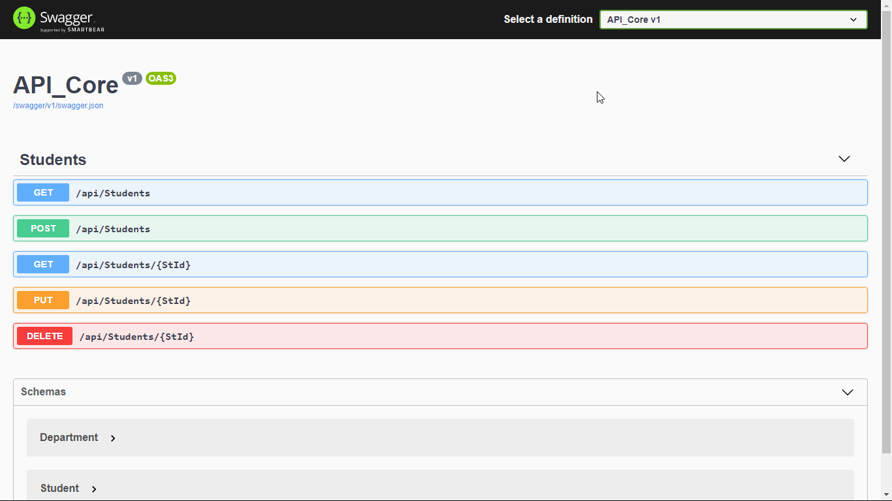
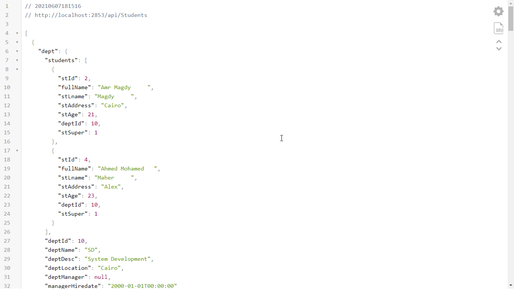
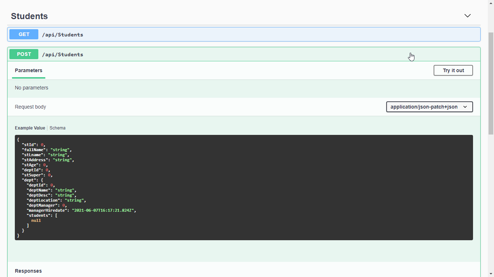
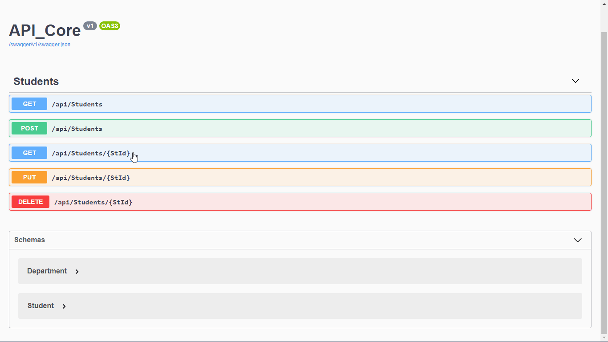
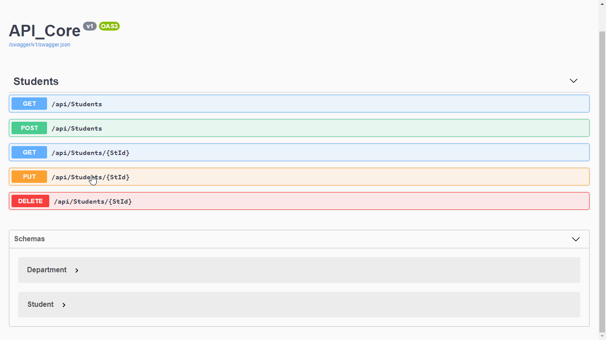
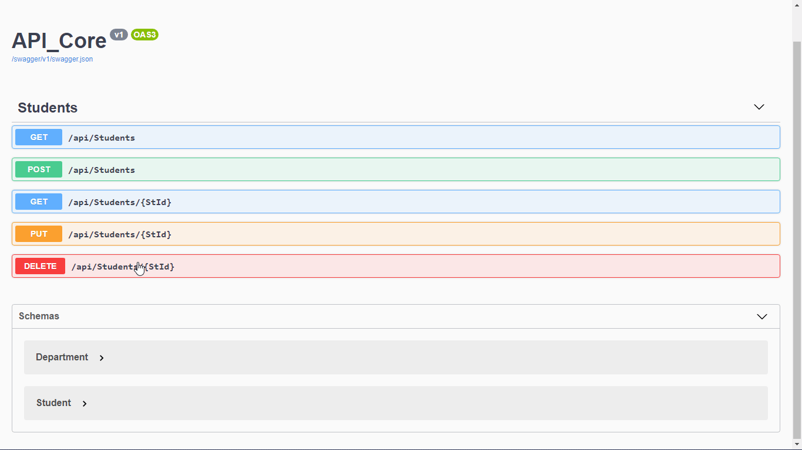

# .Net Core APIs:
  RESTful services (APIs) using C#.

                  Connected to Local SQL Server.
                  Using Swagger to generate documenation.

## Components :
     - Student Controller                  
     - Models => (Student, Department)
     - Repository Deisgn Pattern (IStudent Interface, StudentRepository Class )

---

**Getting All Students with  Department**

---

**Adding New Student**

---

**Get Student By Id**

---

**Edit Student**

---

**Remove Student**

